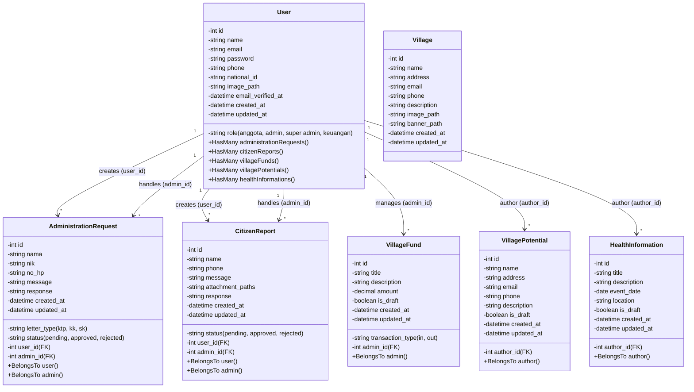

# Class Diagram - Village Management System

## Diagram UML Menggunakan Mermaid

## Penjelasan Relasi Antar Model

### 1. **User ↔ AdministrationRequest**

-   **1 to Many**: Satu user dapat membuat banyak permintaan administrasi (user_id)
-   **1 to Many**: Satu user (admin) dapat menangani banyak permintaan administrasi (admin_id)
-   **Status**: pending, approved, rejected
-   **Tipe Surat**: KTP, KK, SK

### 2. **User ↔ CitizenReport**

-   **1 to Many**: Satu user dapat membuat banyak laporan warga (user_id)
-   **1 to Many**: Satu user (admin) dapat menangani banyak laporan (admin_id)
-   **Status**: pending, approved, rejected

### 3. **User ↔ VillageFund**

-   **1 to Many**: Satu user (admin/keuangan) dapat mengelola banyak transaksi dana desa (admin_id)
-   **Tipe Transaksi**: in (pemasukan), out (pengeluaran)
-   **Draft Status**: Dapat disimpan sebagai draft sebelum publikasi

### 4. **User ↔ VillagePotential**

-   **1 to Many**: Satu user dapat membuat banyak potensi desa (author_id)
-   **Draft Status**: Dapat disimpan sebagai draft sebelum publikasi
-   **Informasi**: Nama, alamat, email, telepon, deskripsi

### 5. **User ↔ HealthInformation**

-   **1 to Many**: Satu user dapat membuat banyak informasi kesehatan (author_id)
-   **Draft Status**: Dapat disimpan sebagai draft sebelum publikasi
-   **Informasi**: Judul, deskripsi, tanggal event, lokasi

### 6. **Village**

-   Model dasar untuk informasi desa
-   Belum memiliki relasi eksplisit dengan model lain (dapat dikembangkan)

## Ringkasan Struktur Data

| Model                     | Tujuan                           | Relasi Utama                      |
| ------------------------- | -------------------------------- | --------------------------------- |
| **User**                  | Manajemen pengguna & autentikasi | Center hub untuk semua model lain |
| **Village**               | Informasi desa                   | Standalone (belum terhubung)      |
| **AdministrationRequest** | Permintaan surat administratif   | User (creator & handler)          |
| **CitizenReport**         | Laporan dari warga               | User (creator & handler)          |
| **VillageFund**           | Manajemen dana/kas desa          | User (admin/keuangan)             |
| **VillagePotential**      | Potensi wisata/usaha desa        | User (author)                     |
| **HealthInformation**     | Informasi kesehatan & kegiatan   | User (author)                     |

## Role User

-   **anggota**: Warga biasa yang dapat membuat laporan dan permintaan
-   **admin**: Admin desa yang dapat menangani permintaan dan laporan
-   **super admin**: Administrator sistem dengan akses penuh
-   **keuangan**: Khusus mengelola dana/kas desa

---

_Diagram ini dibuat berdasarkan struktur model Eloquent Laravel yang tersimpan di `/app/Models`_
